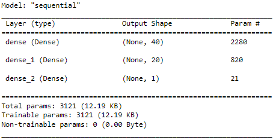

#  Background
The nonprofit foundation Alphabet Soup wants a tool that can help it select the applicants for funding with the best chance of success in their ventures. Using machine learning and neural networks, we’ll use the features in the provided dataset to create a binary classifier that can predict whether applicants will be successful if funded by Alphabet Soup.

From Alphabet Soup’s business team, we have received a CSV containing more than 34,000 organizations that have received funding from Alphabet Soup over the years. Within this dataset are a number of columns that capture metadata about each organization, such as:

	- **EIN** and **NAME**—Identification columns
	- **APPLICATION_TYPE**—Alphabet Soup application type
	- **AFFILIATION**—Affiliated sector of industry
	- **CLASSIFICATION**—Government organization classification
	- **USE_CASE**—Use case for funding
	- **ORGANIZATION**—Organization type
	- **STATUS**—Active status
	- **INCOME_AMT**—Income classification
	- **SPECIAL_CONSIDERATIONS**—Special considerations for application
	- **ASK_AMT**—Funding amount requested
	- **IS_SUCCESSFUL**—Was the money used effectively

# Preprocessing the Data And Descriptive Anlaysis
We will use Pandas and scikit-learn’s `StandardScaler()` to preprocess the dataset. The data consists of 34299 records for organizatuions that received funding. Out of these recorde, according to the label column `IS_SUCCESSFUL`, there are 18261 organizations that are labeled as 1 (meaning that efficiently used the budget) and 16038 organizations labeled as 0. In other words, around 53% of the data are labeled 1 and approximately 47% are labeled 0. This means that the data is balanced well between the two labels.

In order to make the data ready and find the right model, we first figure out how the data look like. The number of unique values in each column is 

Next we count the number of unique types in each categorical feature. Features `AFFILIATION`, `USE_CASE`, and `ORGANIZATION` have relatively small number of categories but it might be better to do some kinds of binning for `APPLICATION_TYPE` and `CLASSIFICATION` features. This might improve the performance of our machine learning and optimization models.

After finding appropriate binnings for these features we use pandas' `get_dummies()` function to conver the categorical to numerical features. More details for binning will be provided while explaining the machine learning models used for this classification. 

# Machine Learning Model
We will use deep learning to perform classification for the data. We incorporate the `train_test_split()` function of scikit-learn to split the preprocessed data into train and test data. 

## Compile, Train, and Evaluating the Model
Using Tensorflow we design a neural network, or deep learning model, to create a binary classification model that can predict if an Alphabet Soup-funded organization will be successful based on the features in the dataset. 

### Optimizng Our Model
Depending on the number of features we can set the number of neuron for the hidden layers in our model. Here our featues might vary betwwn 40 to 60 features and so with trials and erros we determine the better number of neurons, depending on the accuracy that we get from our model. To optimize our model we need to determine appropriate activation functions for hidden and output layers. Here is our settings in our 3 models:
	- **Model 1:** In this model we have 42 features. We start our trial and erros with small number of nodes for hidden layers. We use a 2 hidden layers model with ReLU as activation function for Hidden layers and Sigmiod function for output layer.
		
		We set 100 epochs to fit the model and with this settings this model is 72.44% accurate.
		
	- **Model 2:** In this model we have a new binning for our features and in the end we have 43 features. We use a one hidden layer model with ReLU as activation function for the hidden layer and Sigmiod function for output layer.
		
		Again we set 100 epochs to fit the model. Using this simple setting we get a 72.58% accuracy for this model.
		
	- **Model 3:** Finally in the last model and parameter tunning we have 56 features. We use a two hidden layers model with ReLU as activation function for Hidden layers and Sigmiod function for output layer.
		
		For the final tunning we set 200 epochs to fit the model and we get 72.79% accuracy.
		