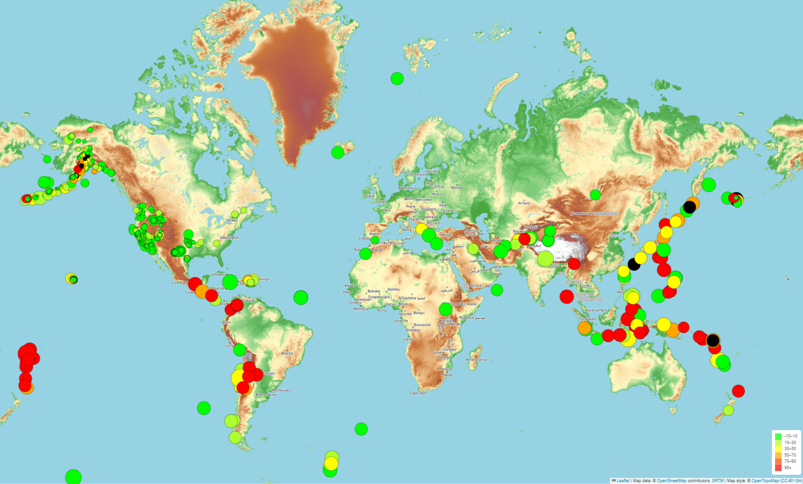

# BackGround:
The United States Geological Survey, or USGS for short, is responsible for providing scientific data about natural hazards, the health of our ecosystems and environment, and the impacts of climate and land-use change. Their scientists develop new methods and tools to supply timely, relevant, and useful information about the Earth and its processes.

The USGS is interested in building a new set of tools that will allow them to visualize their earthquake data. They collect a massive amount of data from all over the world each day, but they lack a meaningful way of displaying it. Here we develop a way to visualize USGS data that will allow them to better educate the public and other government organizations (and hopefully secure more funding) on issues facing our planet.

## Earthquake Visualization
Dataset resource is from <a href="https://earthquake.usgs.gov/earthquakes/feed/v1.0/geojson.php" target="_blank">USG GeoJSON Feed</a>
    - We use Leaflet to create a map that plots all the earthquakes from the given dataset based on their longitude and latitude.
    - Popups that provide additional information about the earthquake when its associated marker is clicked also included.
    - We also added a legend that will provide context for your map data.
    

## Refrences: 
Dataset created by the <a href="https://earthquake.usgs.gov/earthquakes/feed/v1.0/geojson.php" target="_blank">United States Geological Survey</a> 