# Walmart Daily Sales Forecasting

## Overview

In this project we will use machine learning methods and techniques to forecast daily sales of Walmart using hierarchical sales data from Walmart.

## Dataset
The dataset for this project is made by **Walmart**, involves the unit sales of various products sold in the USA, organized in the form of **grouped time series**. More specifically, the dataset involves the unit sales of 3,049 products, classified in **3 product categories** (Hobbies, Foods, and Household) and **7 product departments**, in which the above-mentioned categories are disaggregated.  The products are sold across ten stores, located in three States (CA, TX, and WI). 

The dataset consists of the following three (3) files:

* File 1: “calendar.csv”
Contains information about the dates the products are sold.
	-	**date:** The date in a “y-m-d” format.
	-	**wm_yr_wk:** The id of the week the date belongs to.
	-	**weekday:** The type of the day (Saturday, Sunday, …, Friday).
	-	**wday:** The id of the weekday, starting from Saturday.
	-	**month:** The month of the date.
	-	**year:** The year of the date.
	-	**event_name_1:** If the date includes an event, the name of this event.
	-	**event_type_1:** If the date includes an event, the type of this event.
	-	**event_name_2:** If the date includes a second event, the name of this event.
	-	**event_type_2:** If the date includes a second event, the type of this event.
	-	**snap_CA, snap_TX, and snap_WI:** A binary variable (0 or 1) indicating whether the stores of CA, TX or WI allow SNAP  purchases on the examined date. 1 indicates that SNAP purchases are allowed.

* File 2: “sell_prices.csv”
Contains information about the price of the products sold per store and date.
	-	**store_id:** The id of the store where the product is sold. 
	-	**item_id:** The id of the product.
	-	**wm_yr_wk:** The id of the week.
	-	**sell_price:** The price of the product for the given week/store. The price is provided per week (average across seven days). If not available, this means that the product was not sold during the examined week. Note that although prices are constant at weekly basis, they may change through time (both training and test set).  
	
* File 3: “sales_train.csv” 
Contains the historical daily unit sales data per product and store.
	-	**item_id:** The id of the product.
	-	**dept_id:** The id of the department the product belongs to.
	-	**cat_id:** The id of the category the product belongs to.
	-	**store_id:** The id of the store where the product is sold.
	-	**state_id:** The State where the store is located.
	-	**d_1, d_2, …, d_i, … d_1941:** The number of units sold at day i, starting from 2011-01-29. 

## Extracting and Reading Data

The data set is available in the kaggle competition [m5-forecasting-accuracy](https://kaggle.com/competitions/m5-forecasting-accuracy). After extracting the data we will be transforming it to ML friendly formats and save it for our future machine learning model. After importing dependencies, we will have two methods to extract or read the data. In method 1 we incorporate pyspark module and its functions to read the data and visualize it. We will also create a temporarty view of the data to save memory while querying the data. This method is helpful when we deal with big data. In second method we directly use Pandas to read the data. 
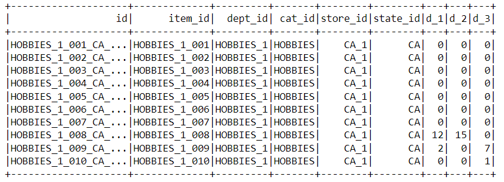

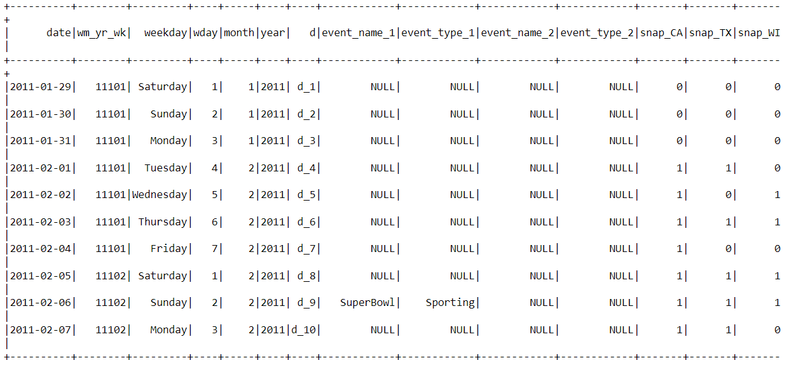

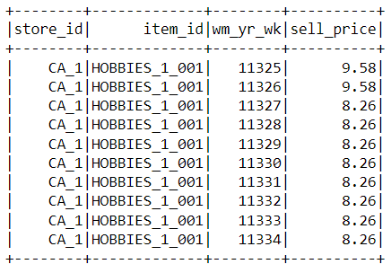

<!--  -->

## Preprocessing Data

#### Separating dataframes for 3 states
We will attempt to forecast the daily sales of all 10 Walmart stores separately. To that end we separate the data set into 3 data frames, one for each of the states California, Texas and Wisconsin.

	- California Sales dataframe has shape **(12196, 1947)** with 0 NA values
	- Texas Sales dataframe has shape **(9147, 1947)** with 0 NA values
	- Wisconsin Sales dataframe has shape **(9147, 1947)** with 0 NA values

We also separate the Sell Prices dataframe for all 10 stores in three states:
	
	- California sell_prices dataframe has shape **(2708822, 4)** with 0 NA values
	- Texas sell_prices dataframe has shape **(2092122, 4)** with 0 NA values
	- Wisconsin sell_prices dataframe has shape **(2040177, 4)** with 0 NA values

#### Melting the train dataframe
Since sell dates for all stores are given as columns for different items we melt the date columns into one column. A smple of the meleted dataframe for Califoria stores is shown below:
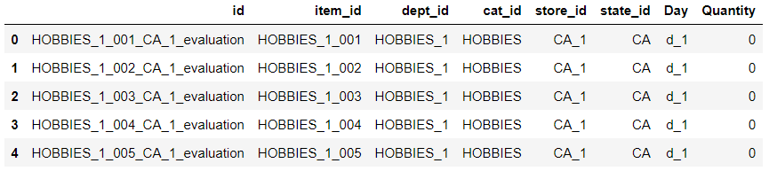

#### Merging all dataframes

After separating dataframes for three staes and melting the sales dataframe or date columns, all three dataframes are now ready to be merged. We merge the calendar and sell_prices dataframes into the sales dataframe for all three states, separately.
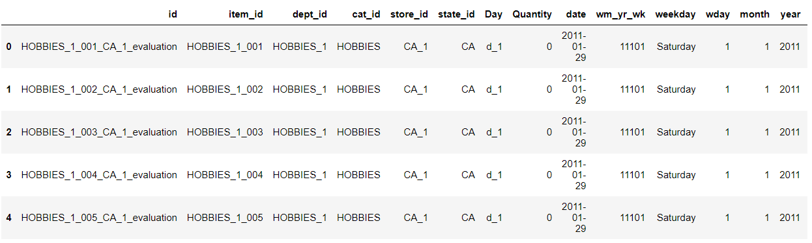

### Aggeragating Data
While we will forecast the sales fo the stores in the three states, at this step we aggeregate the merged dataframes and sum over sales of each item sold in each date. Then we will have the total sales for each store in each day in each state, separately. In current version of dataframe we only keep the total sales and then in feature engineering part, we will add extra features. A sample of each of the total_sales dataframes for each states is shown below:

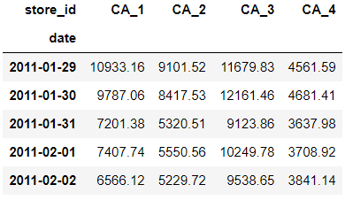

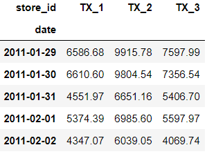

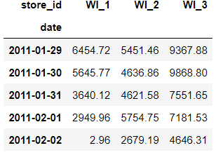

### Graphical Representation of dasets
For graphical representatin of the datasets we first plot the dataset as is, with the date as their indexand total sales as thier y-axis.

The Calfornia total sales for each store is 

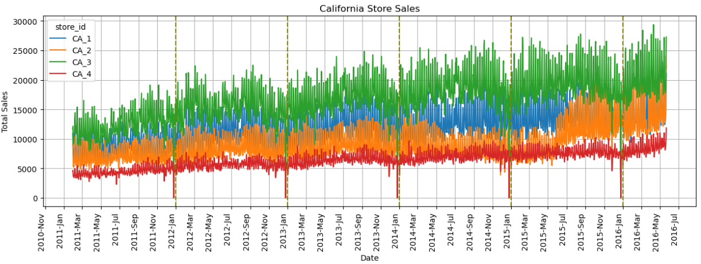

The Texas total sales for each store is 

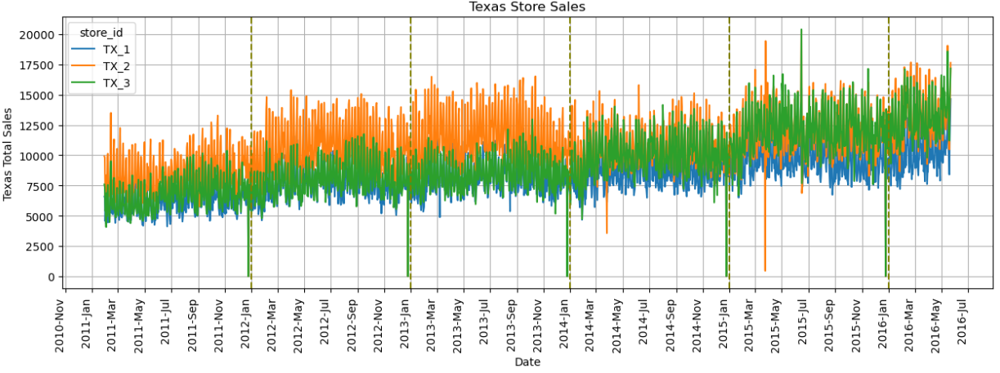

The Wisconsin total sales for each store is 

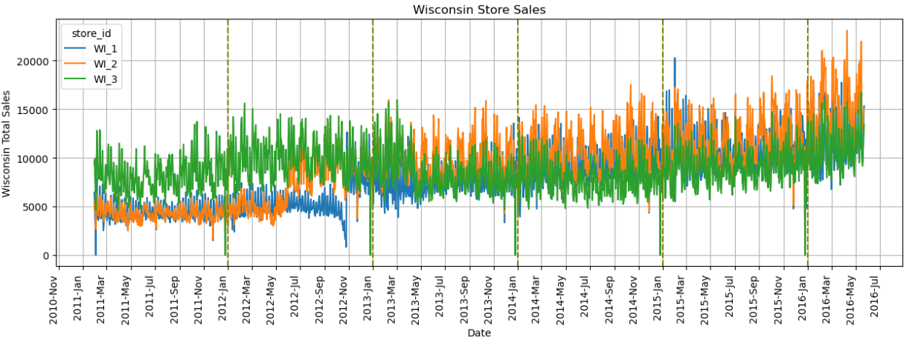

Any who looks at these plot, a quick drop in totals salse for all stores at a certain time of each year would catch their eyes. A closer look in one of those intervals look like 

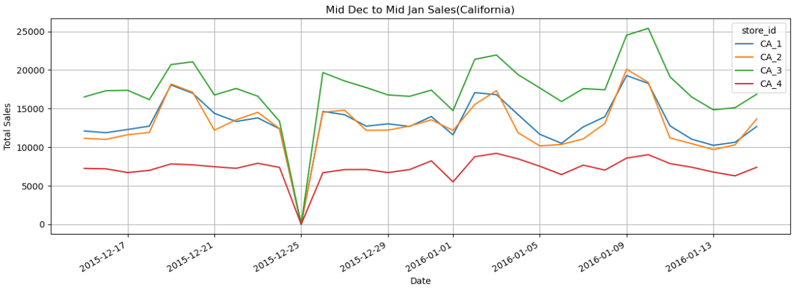

To see a trend of sales for each of the stores in each state we also plotted a 30 day moving window mean for each state. These would tell us more stories about the total sales of the stores and their up and down and in general, seasonal sales.

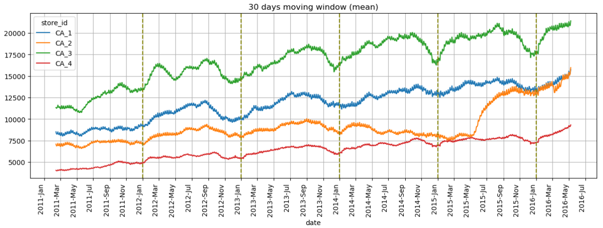

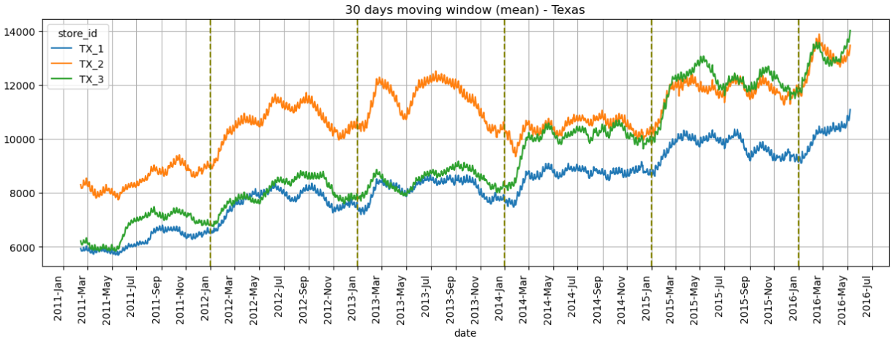

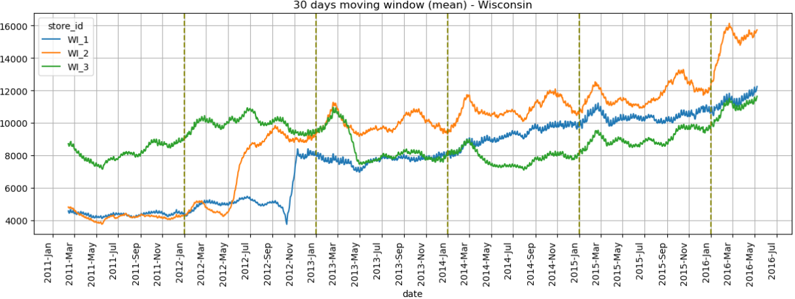

In addition, for each store in each state, we have created  a box plot for each year for total sales. One fact that we would get from these plots is that we would know how total sales are distributed among years among stores and if we need normalization of the data or not.

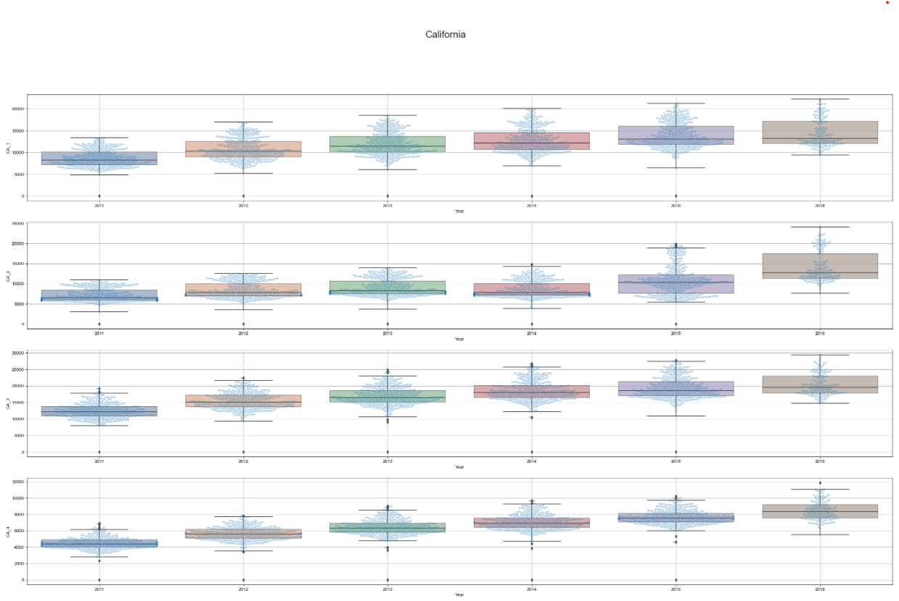

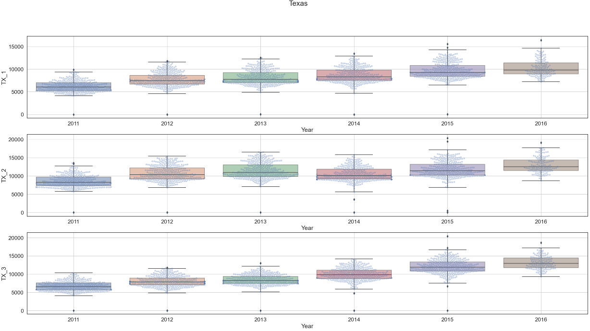

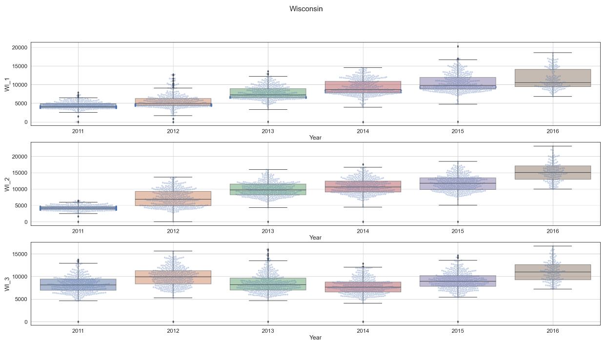

From the above plots we may conclude that data is approximately normally distributed in each year among stores in each state. Almost in all cases, boxplots look very symetric and they ocasionally have ouliers.

## Feature Engineering

In order to perform feature engineering we first separate each store in a new dataframe for each state. These dataframes will contain a date column as index and total daily sales. Then we add new features to each dataframes.

#### Lag features
From graphca representatins we figured out that there are definitely seasonal patterns in the trend of the data for each state and store daily sales. Therefore, it makes sense if we add lag features to improve our timeseries model performance. Our lag features will shift the otiginal time , 1 day, 2 days, 3 days, 4days, 5 days, 6 days, 1 year and 2 years time periods. A sample of one of the dataframe looks like the following after adding lag features.

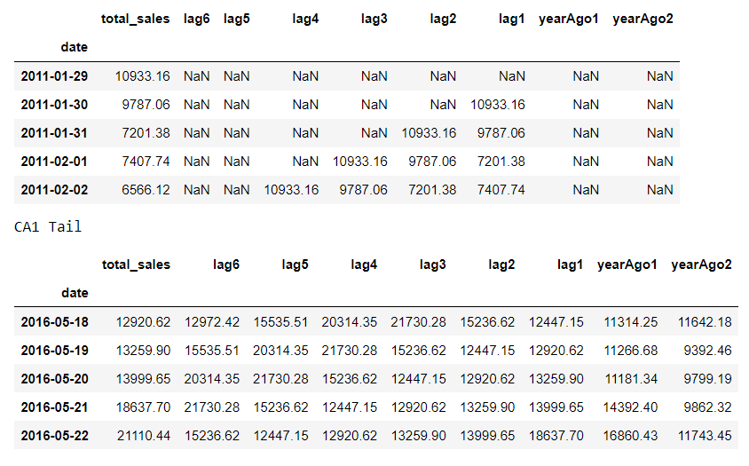

#### Calendar features

Next, we add calendar features to each data frame. These features are event names and types, and also boolean feature indicating whether a store has had snap sale in given date. Events and snap dates play an importnt role in improving the perfomance of our forecasting mdoel.

#### One-Hot-Encoding

Finally we convert the categorical columns such as event names and even types into numerical using `pandas.get_dummies()` function of pandas library. This wil create a column with a binary variable for each category of the data. In the ebd, each of the dataframes will contain 53 features.

# Machine Learnin model

To perform forcassting for the preprocessed data, we use `sklearn` module and its `train_test_split` to split the data set into train and test data sets. We split the data set in the way that we keep the data fram the last 20 days as test data and the rest for training model. To train the model we use the `XGBoost` library and its `XGBRegressor` function. **XGBoost** or **Extreme Gradient Boosting** is an open-source library that implements the gradient boosing algorithm. We used  the follwoing parameter tunig for our model.
	
	- **Number of Estimators:** _1000_
	- **Early Stoppiong Rounds:** _100_
	- **Learning Rate:** _0.01 to 0.9 depending on the data set_
	- **Verbose:** _100 iterations_
	
To represent the error of the model after final iteration we used `mean_squared_error` for model accuracy and `mean_absolute_percentage_error` for naive error. 
Note that according to [This](https://machinelearningmastery.com/xgboost-for-regression/) "**gradient boosting** refers to a class of ensemble machine learning algorithms that can be used for classification or regression predictive modeling problems. Ensembles are constructed from decision tree models. Trees are added one at a time to the ensemble and fit to correct the prediction errors made by prior models. This is a type of ensemble machine learning model referred to as boosting."
Boosting, in this case, combines decision trees with only one split (stump) sequentially, in a way that the new tree has smaller error that the previous one. In our the first decision tree for CA_1 store in California is:
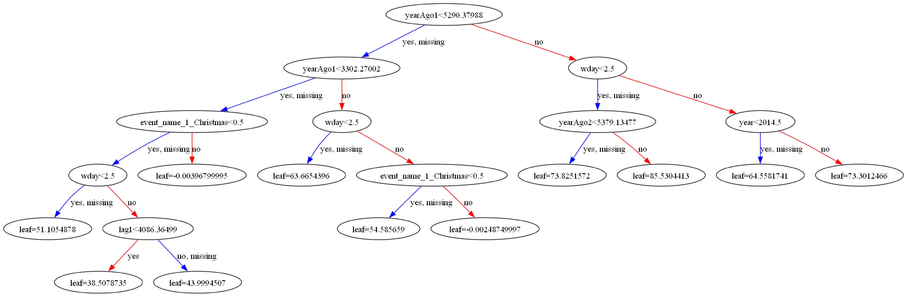

## Our Model vs Naive FOrecaster (Comparison)
Here is acomparison of the performnce of our model and the naive forecaster (1 year ago data) with mean absolute percentage error:
	
	- **California:**
		- **CA_1:** Naive forecaster error = 0.15, Our model error = 0.06
		- **CA_2:** Naive forecaster error = 0.48, Our model error = 0.09
		- **CA_3:** Naive forecaster error = 0.12, Our model error = 0.05
		- **CA_4:** Naive forecaster error = 0.16, Our model error = 0.06
	
	- **Texas:**
		- **TX_1:** Naive forecaster error = 0.15, Our model error = 0.09
		- **TX_2:** Naive forecaster error = 0.14, Our model error = 0.07
		- **TX_3:** Naive forecaster error = 0.11, Our model error = 0.08
		
	- **Wisconsin:**
		- **WI_1:** Naive forecaster error = 0.21, Our model error = 0.09
		- **WI_2:** Naive forecaster error = 0.26, Our model error = 0.08
		- **WI_3:** Naive forecaster error = 0.24, Our model error = 0.07

Here is a graphicalrepresentation of the test data versus our model versus the naive forcaster

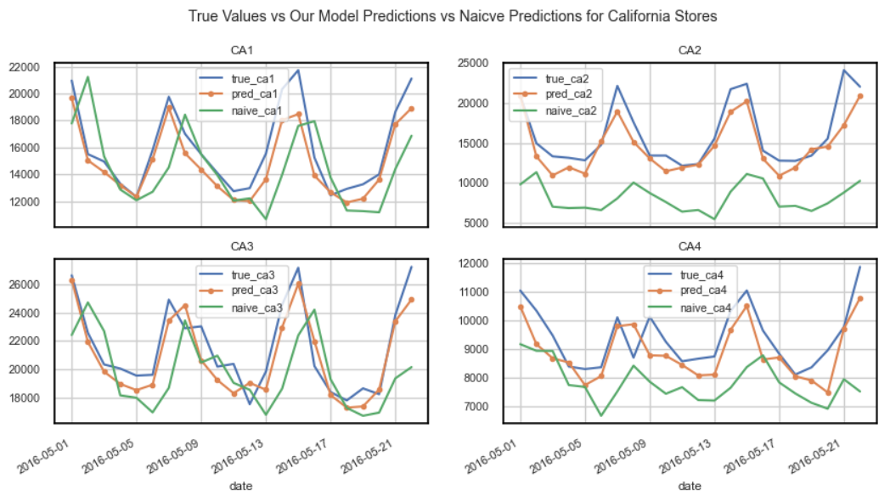

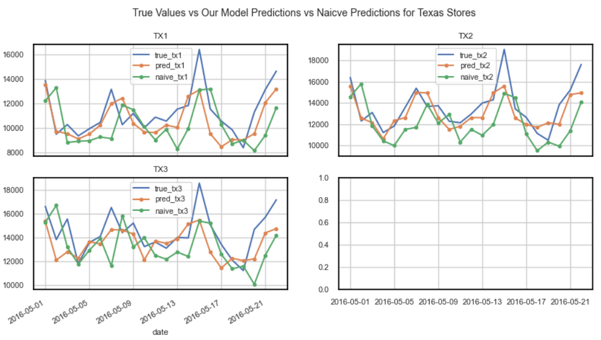

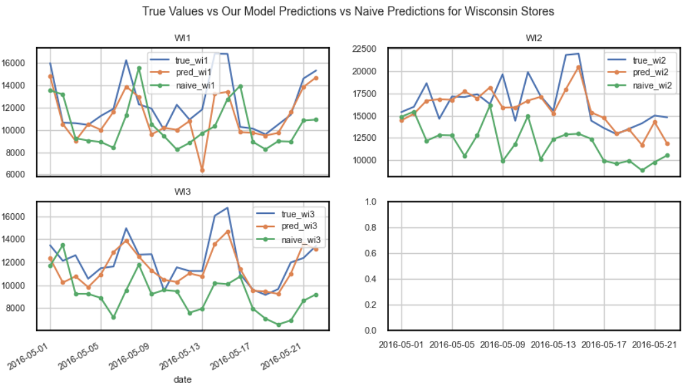

### Feature Importance and comclusions

Finally we plot the importance score of each feature for each store in each state.

	* In California weekday is the most important feature for store 1 and 2, but 1 year ago infomation and Christmas event are more important in stores 3 and 4.
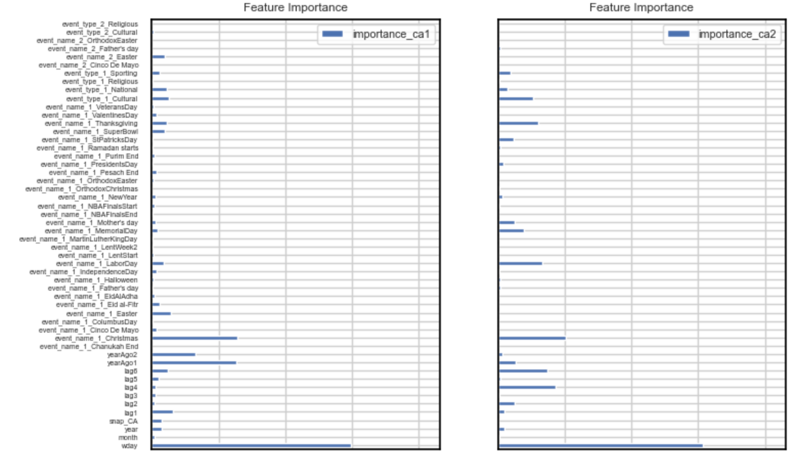
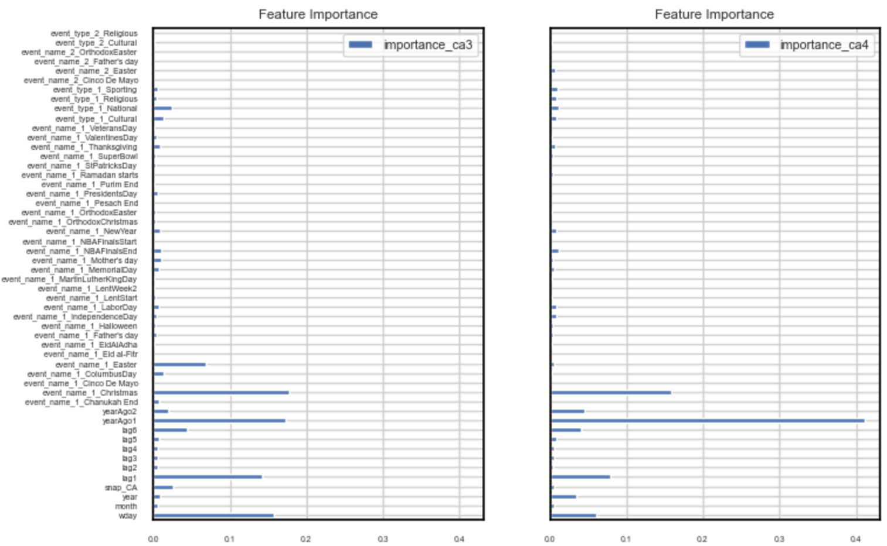

	* In Texas Christmas event and weekday are more imortant features for store 1 and 2, and feature 'year' is more important for store 3.
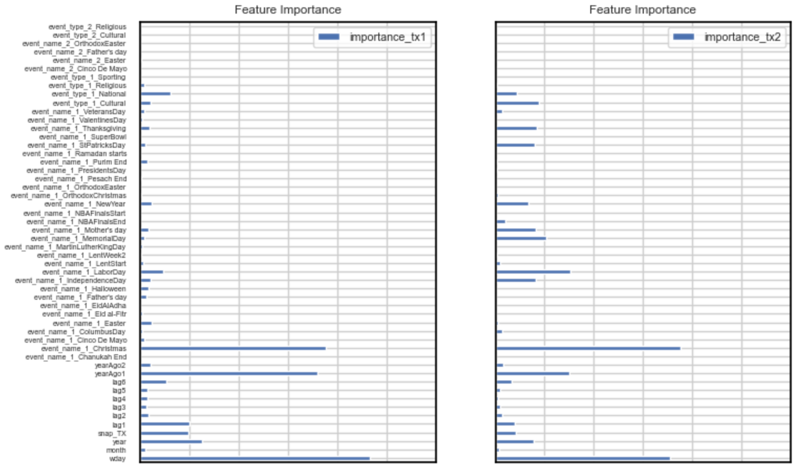
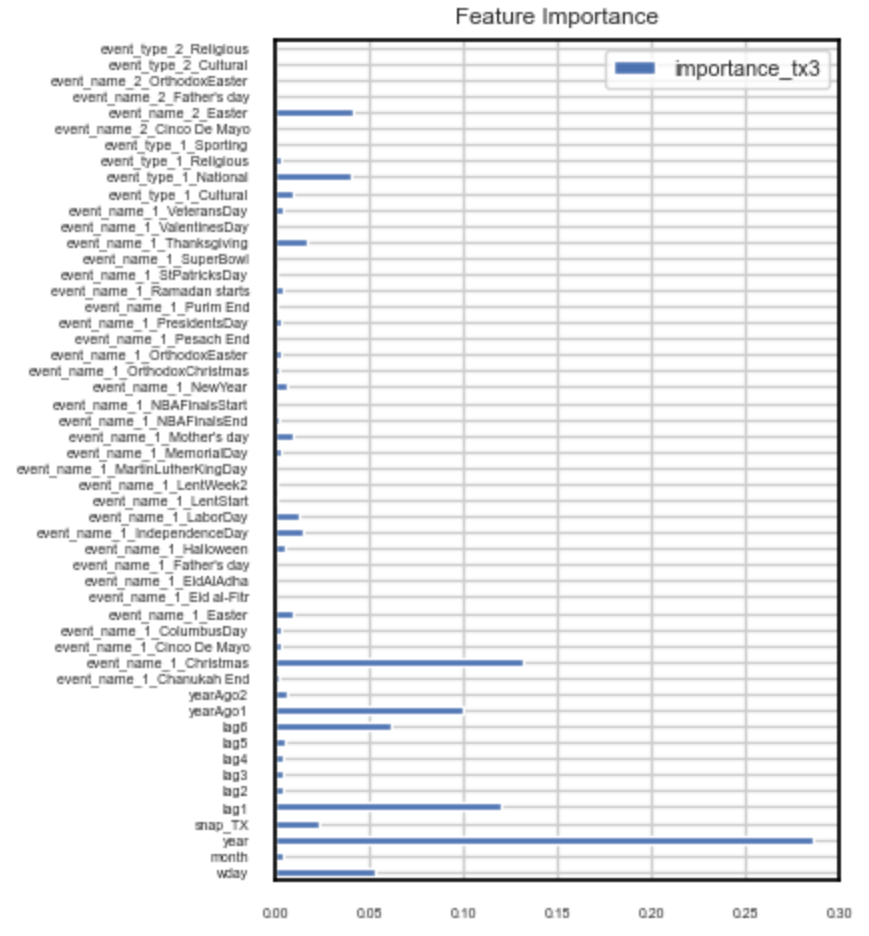

	* In Wisconsin 1 day lag and 'year' feature are more important for store 1, Christmas event and one day lag are more important for store 2, and Christmas and national day events are more imoportant for store 3.

# Reference
Addison Howard, inversion, Spyros Makridakis, vangelis. (2020). M5 Forecasting - Accuracy. Kaggle. https://kaggle.com/competitions/m5-forecasting-accuracy